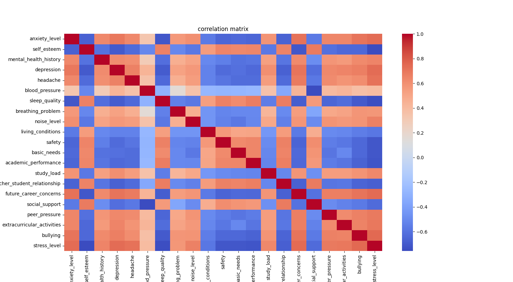
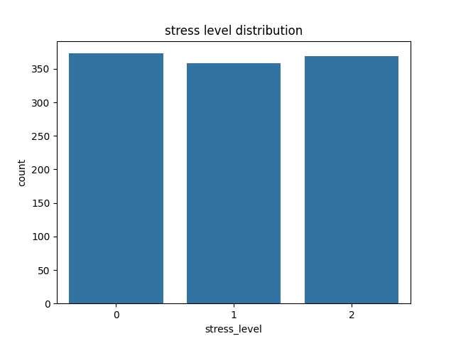

# Stress Level Prediction using Data Analysis and Machine Learning

## Overview
This project analyzes factors that influence student stress levels and builds a machine learning model to predict stress levels.

## Objective
- Analyze relationships between variables
- Visualize the data using graphs and heatmaps
- Build a model to predict stress levels

## Dataset
The dataset contains 1101 observations of students and includes psychological, academic, and social factors such as:
- Anxiety
- Sleep quality
- Depression
- Social support

The target variable is **stress_level**.

## Data Analysis
- Correlation matrix was used to examine relationships
- Heatmap visualization shows positive and negative correlations
- Key insights:
  - Anxiety and depression are positively correlated with stress
  - Sleep quality is negatively correlated with stress
  - Social support helps reduce stress

## Visualization

### Correlation Heatmap

### Stress Level Distribution

## Machine Learning Model
- Data split: 80% training / 20% testing
- Model used: Logistic Regression
- Predictions made on test data

## Results
The model achieved an accuracy of **88.6%**, indicating good predictive performance.

## Conclusion
- Several factors influence stress levels
- The model provides a basic but effective prediction
- Future improvements could include trying more advanced models

## Project Files
- `stress_analysis.py` → Python code for analysis and model  
- `heatmap.png` → Correlation heatmap  
- `distribution.png` → Stress level distribution  
- `stress_presentation.pptx` → Project presentation
- `StressLevelDataset.csv` → Dataset used for analysis

 ## Future Improvements
- Try more advanced models (e.g., Decision Tree, Random Forest)  
- Improve feature selection  
- Perform deeper statistical analysis  

